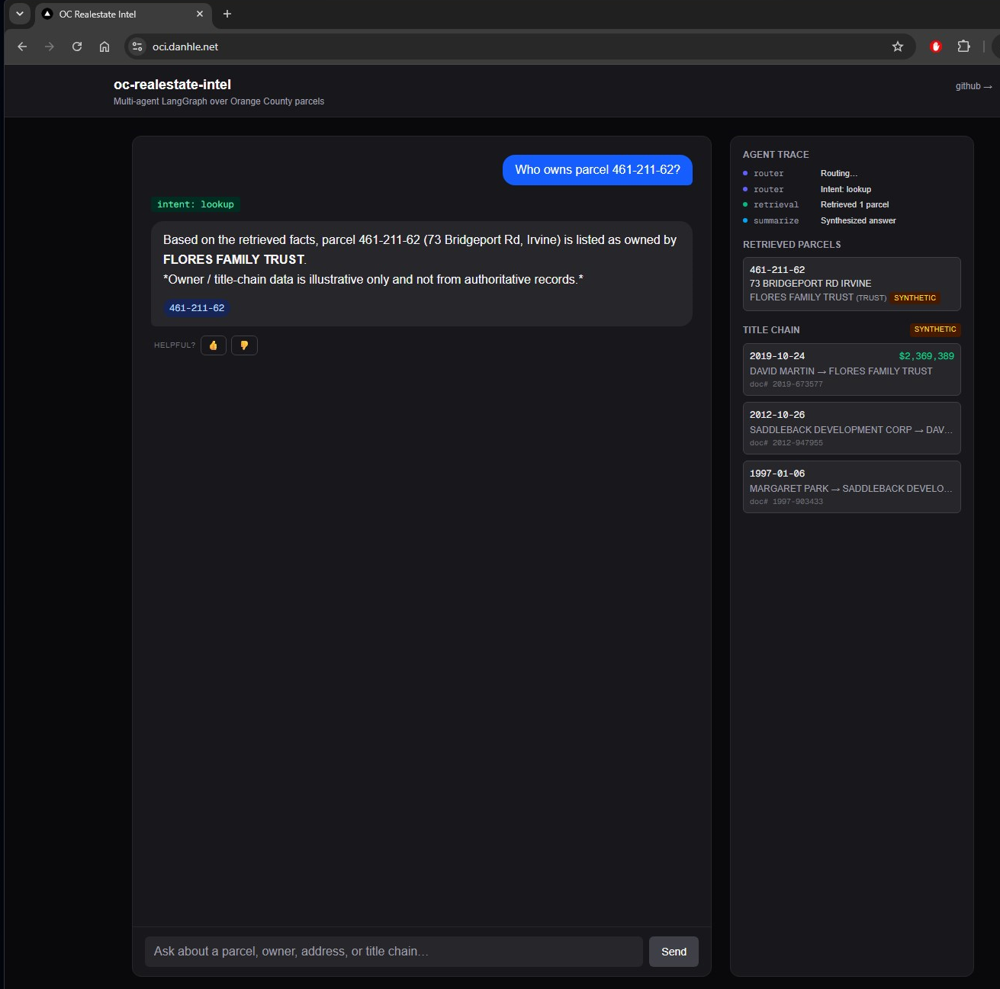
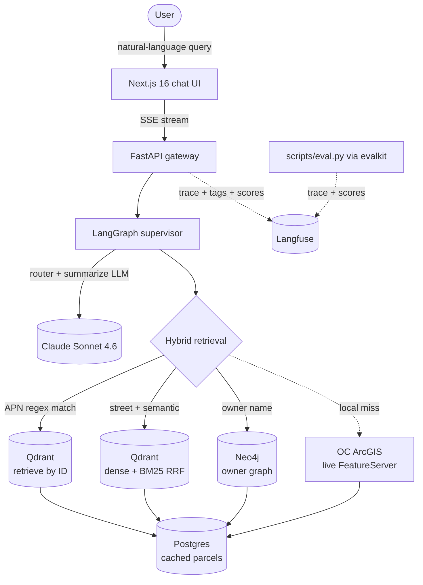
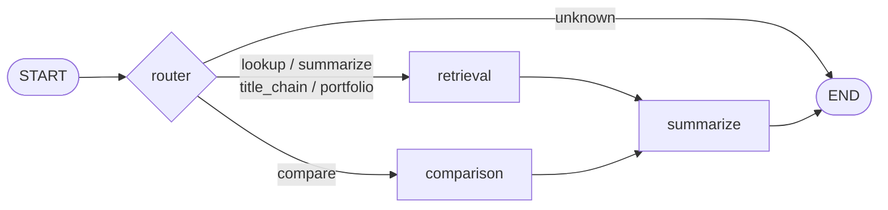
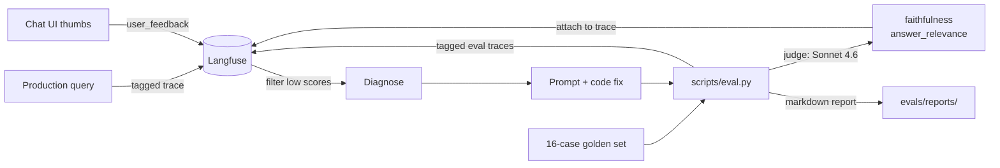
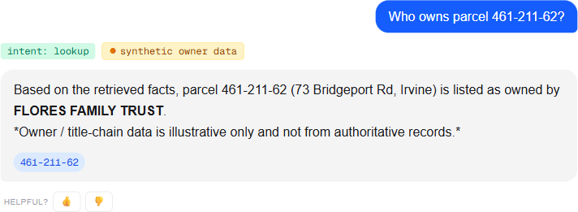

# oc-realestate-intel

**Multi-agent LangGraph system over Orange County real-estate + title data.** Hybrid retrieval (BM25 + dense + RRF), live fallback over the full 702k-parcel OC ArcGIS layer, a 5-intent supervisor, evalkit-judged faithfulness, and Langfuse end-to-end tracing — every retrieval path tagged, every answer fact-grounded, every assertion provenance-flagged when the underlying source is synthetic.

`LangGraph` · `LangChain` · `Claude Sonnet 4.6` · `FastAPI` · `SSE` · `Qdrant` (dense + BM25) · `Neo4j` · `Postgres` · `Pydantic v2` · `sentence-transformers` · `Next.js 16` · `React 19` · `Tailwind 4` · `Langfuse` · `evalkit`

| | |
|---|---|
| **Faithfulness** (LLM-judged, 16 cases) | **9.94 / 10** |
| **Citation precision / recall / refusal** | 1.00 each |
| **Model picked by data** | Sonnet 4.6 (Opus offered no measurable lift) |
| **Eval cost / run** | ~$0.07 |

---

## Try it

**Live demo:** [https://oci.danhle.net](https://oci.danhle.net) — 10k OC parcels indexed (Irvine + Newport Beach + Anaheim + Orange), synthetic owners, Langfuse-traced.

Suggested first queries:
- `Who owns parcel 461-211-62?`
- `What does FLORES FAMILY TR own?`
- `Show the title chain for 461-211-62`
- `Find parcels on Bridgeport Road in Irvine`

### Run locally

```powershell
docker compose up -d                                 # Postgres + Qdrant + Neo4j
python -m venv .venv && .\.venv\Scripts\activate
pip install -e ".[dev,embeddings]"
Copy-Item .env.example .env                          # add ANTHROPIC_API_KEY
python -m scripts.seed --recreate --limit 2000       # 2k real Irvine parcels
uvicorn app.main:app --reload --port 8003

cd web && npm install && npm run dev                 # http://localhost:3003
```

Optional Langfuse setup is in [docs/langfuse.md](docs/langfuse.md) — drop two keys in `.env` and every query produces a tagged trace with token counts, latency, costs, and judge scores. Production-deploy notes are in [docs/deploy.md](docs/deploy.md) — Caddy + Hetzner + the snapshot-seed workaround for the geo-blocked ArcGIS endpoint.

---

## Screenshots

<!--
Add these three screenshots (PNG, ~1200px wide) into docs/screenshots/:
  1. chat-ui.png        — the chat UI showing a query + answer + agent trace timeline + citation chips
  2. langfuse-trace.png — a single Langfuse trace waterfall (router → retrieval → summarize → ChatAnthropic)
  3. langfuse-filtered.png — the traces list filtered by tag (e.g. intent:portfolio)
-->

Live UI at [oci.danhle.net](https://oci.danhle.net):



| Langfuse trace waterfall | Tag filter: every `intent:portfolio` query |
|---|---|
|  |  |

---

## How it works

### System architecture



### Agent flow



The router emits structured JSON `{intent, owner_name?}` and tags the trace with `intent:<value>`. The retrieval node then picks one of four sub-paths and tags `source:<value>`:

| `intent` | Retrieval path | Why |
|---|---|---|
| `lookup` / `summarize` / `title_chain` with APN in query | Qdrant `retrieve(by_id)` | Fast O(1) lookup; semantic search is wrong for IDs |
| `lookup` / `summarize` with address | BM25 + dense via Qdrant RRF | Sparse rescues proper nouns; dense rescues paraphrases |
| `portfolio` | Neo4j `owner_holdings` | The graph IS the right data structure here |
| Any of the above with no local match | Live OC ArcGIS FeatureServer | Reaches the full 702k parcels |

The live fallback uses a relevance heuristic — hybrid search _always_ returns top-k, so `if not parcels:` never fires for out-of-seed addresses. Instead we check whether the query's house-number actually appears in any returned parcel's address, and only then hit the live API.

### Eval-driven dev loop



The eval has surfaced three real bugs so far — a hallucinated URL, speculative transfer characterization, and a bug in the eval itself where the judge wasn't receiving the title chain as context. Each fix is in git history with the before/after report. See [`evals/reports/`](evals/reports/).

---

## What's interesting

- **Hybrid retrieval that actually works on proper nouns.** Pure dense retrieval kept finding "Irvine Ave in Newport Beach" when the user asked for "Bridgeport Rd in Irvine" — the token `Irvine` is everywhere, the rarer `Bridgeport` doesn't carry enough similarity weight. Adding Qdrant's BM25 sparse vectors + Reciprocal Rank Fusion fixed it; the sparse leg rescues exact-token queries that dense drops.

- **Live ArcGIS fallback with a relevance heuristic.** Hybrid search always returns top-k by similarity, not threshold, so `if not parcels:` never fires for out-of-seed addresses. The retrieval node checks "did any returned parcel's address actually contain the query's house number?" If no, fall back to the live OC Public Works FeatureServer (~500ms cache miss), enrich with synthetic owner data, return.

- **Provenance flagging end-to-end.** The OC public ArcGIS layers redact owner names — real assessor data is behind a $3k/yr paywall (ParcelQuest, ATTOM, etc.). So owners are synthetic, deterministically generated per-APN. Crucially, every parcel carries `owner_source: "synthetic"`, the summarize prompt appends an italic disclaimer when synthetic data is in the context, the API response carries a structured `provenance: {owner_data_source, disclaimer}` field, a runtime guard re-appends the canonical disclaimer if the model drops it, and the UI shows an amber `synthetic owner data` chip next to the intent badge. When a real provider is wired in, flip the tag and every layer reverts automatically.

  

  See [ADR-0004](docs/adr/0004-synthetic-owners-with-provenance-flagging.md) for the design and [docs/threat-model.md](docs/threat-model.md#stride-table) rows T1/T3 for the threat-model mapping.

- **Governance node — one explicit place that gates model output.** The disclaimer guard, URL allowlist, and prompt-injection detector all live in a `governance` LangGraph node that runs between `summarize` and `END`. Each check emits its own Langfuse score (so "how often does the disclaimer guard fire?" is a dashboard filter, not a grep) and recurring violations auto-file deduplicated GitHub issues via the same agent's repo. The reusable machinery is extracted as a standalone package, [`agent-governance`](https://github.com/odanree/agent-governance) (pinned at `v0.2.1`), so every other LLM agent in the portfolio can drop it in. The 70-line adapter in [`app/governance.py`](app/governance.py) is everything this repo carries; the protocol, sinks, dedup, and tests live upstream. A GitHub Actions workflow ([`.github/workflows/governance.yml`](.github/workflows/governance.yml)) runs `agent-governance audit . --fail-on warning` on every PR — gating merges on new governance gaps — and files findings as deduplicated issues on push to master (see live example: [#3](https://github.com/odanree/oc-realestate-intel/issues/3)). See [ADR-0007](docs/adr/0007-governance-node-with-incident-sink.md) and [threat-model.md](docs/threat-model.md#stride-table) T1/T2/T13.

- **Model selection by data, not vibes.** Ran the 16-case suite against Haiku 4.5 / Sonnet 4.6 / Opus 4.7 with a fixed judge:

  | metric | Haiku 4.5 | Sonnet 4.6 | Opus 4.7 |
  |---|---|---|---|
  | `intent_accuracy` | 1.00 | 0.94 | 1.00 |
  | `faithfulness` | 9.78 | **9.91** | 9.84 |
  | `answer_relevance` | 6.44 | **6.88** | 6.81 |

  Opus underperformed Sonnet on both judge-scored dimensions. Picked Sonnet. Haiku is a viable cost-down option (lags by ~0.4 on relevance, matches Opus on routing).

- **Langfuse + evalkit bridge.** Every eval case produces a Langfuse trace tagged `eval` + `case:<id>`; faithfulness, answer_relevance, intent_accuracy, citation_recall, citation_precision, refusal_correctness all attach as Langfuse scores on the same trace. Filter `scores.faithfulness < 8` in the dashboard → drill straight to the specific run + the agent's actual node-by-node trace that scored poorly. That's the eval-driven debugging loop with a UI on it.

- **Three bugs the eval caught:**
  1. Agent invented `ocassessor.gov` → tightened prompt against external resources.
  2. Title chain answers characterized transfers ("arm's-length", "inter-family") → tightened prompt against speculation.
  3. Judge was getting parcels but not graph_facts as context → it correctly flagged every title-chain claim as ungrounded → fixed the eval's context formatter. Faithfulness 8.46 → 9.96.

---

## Project layout

```
app/
  agents/       LangGraph supervisor + tools + state
  routers/      /query (JSON + SSE), /feedback, /health
  services/     vector (Qdrant), graph (Neo4j), db (Postgres), live_arcgis
  ingestion/    arcgis_parcels (real), synthetic_owners (placeholder for paywall)
  observability.py     Langfuse callback factory + tag accumulator
  config.py     pydantic-settings
scripts/
  seed.py       OC ArcGIS → Postgres + Qdrant + Neo4j
  eval.py       Run golden set, score with evalkit, attach to Langfuse
  sweep.py      Model comparison across Haiku/Sonnet/Opus
evals/
  golden.yaml             16-case spec
  reports/*.md            Per-run reports (latest, sweep, provenance debug)
web/
  src/app/components/     Chat / AgentTrace / ParcelList / TitleChain
  src/lib/api.ts          SSE parser + feedback POST
tests/                    37 tests covering routing, normalization, sparse vectors, citations, synthetic chains, fallback heuristic
```

---

## Design docs

- [Architecture decision records](docs/adr/) — seven MADR-format ADRs covering LangGraph, Qdrant + BM25, Neo4j, synthetic-owner provenance, Langfuse + evalkit, MCP, and the governance node.
- [C4 architecture](docs/architecture/) — system context, container, and component diagrams (PlantUML, C4-PlantUML stdlib).
- [Threat model](docs/threat-model.md) — STRIDE-style review with emphasis on LLM-specific risks: prompt injection, output disclosure, synthetic-data spoofing, cost amplification.

---

## Roadmap

- [x] Real OC ArcGIS ingestion (2k Irvine seed; 702k live-fallback reachable)
- [x] Hybrid retrieval (BM25 + dense + RRF + APN fast-path)
- [x] Owner + title-chain graph with synthetic provenance flagging
- [x] 5-intent LangGraph supervisor (lookup, compare, summarize, title_chain, portfolio)
- [x] FastAPI + SSE + Next.js streaming UI with thumbs feedback
- [x] evalkit-powered 16-case scorecard
- [x] Model comparison sweep
- [x] Langfuse observability (tags, scores, trace-id round-trip)
- [ ] Real owner provider (ATTOM / ParcelQuest swap path; interface is provider-agnostic)
- [ ] 30+ case eval coverage
- [ ] Public deployment (Vercel + Railway + managed DBs)
- [ ] Loom architecture walkthrough

---

## License

MIT
