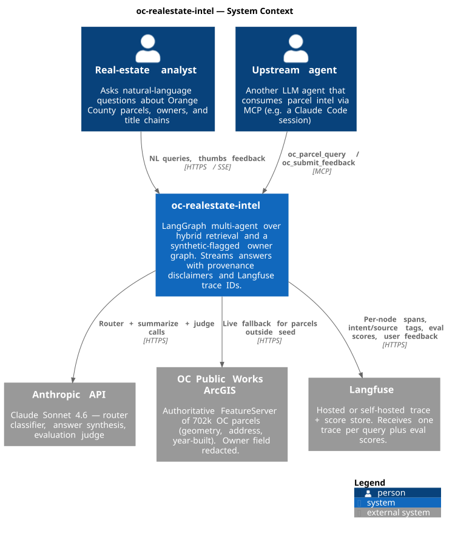
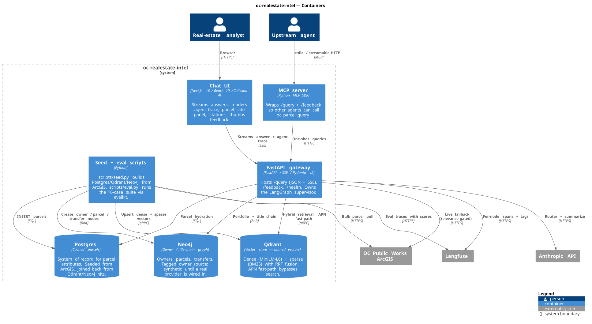
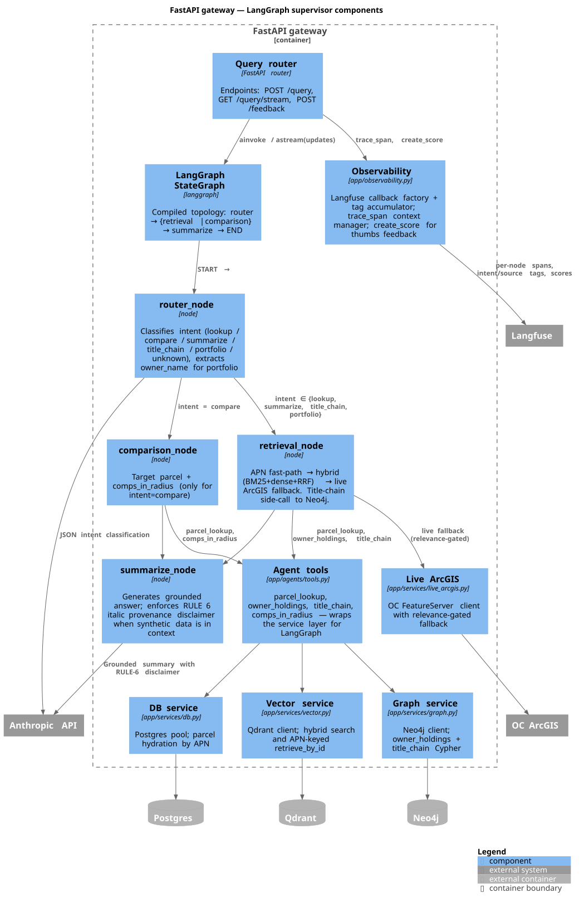

# Architecture (C4 model)

A C4 model of oc-realestate-intel at three zoom levels. Source is PlantUML with the C4-PlantUML stdlib; rendered SVGs are committed alongside so they render directly on GitHub without a proxy.

| Level | What it shows | Source | Audience |
|---|---|---|---|
| **1. Context** | Users + external systems around the agent | [c4-context.puml](c4-context.puml) | Anyone — execs, reviewers, new hires |
| **2. Container** | Deployable units: web, API, Postgres, Qdrant, Neo4j, Langfuse | [c4-container.puml](c4-container.puml) | Engineers integrating with the system |
| **3. Component (Agent)** | LangGraph nodes inside the FastAPI gateway | [c4-component-agent.puml](c4-component-agent.puml) | Engineers changing agent behavior |

## 1. System context



## 2. Containers



## 3. Components — LangGraph supervisor inside the FastAPI gateway



## Re-rendering after edits

The committed SVGs are produced from the `.puml` sources. After editing a source, regenerate via either:

**Locally:**

```powershell
# one-time
choco install plantuml          # or: scoop install plantuml

plantuml -tsvg docs/architecture/*.puml
```

**Via plantuml.com (no install, requires `xxd` + `curl` — bash):**

```bash
for f in docs/architecture/*.puml; do
  hex=$(xxd -p -c 999999 "$f" | tr -d '\n')
  curl -sS -o "${f%.puml}.svg" "https://www.plantuml.com/plantuml/svg/~h${hex}"
done
```

VS Code: the *PlantUML* extension previews live with `Alt+D`.

## What's intentionally not modelled

- **Code level (C4 level 4).** Class diagrams add overhead without insight at this size; the agent has 5 LangGraph nodes and ~10 service modules. Reading `app/agents/supervisor.py` is faster.
- **Dynamic/runtime diagrams.** The agent flow Mermaid block in the project [README](../../README.md#agent-flow) covers this with less PlantUML noise.
- **Deployment topology.** See [docs/deploy.md](../deploy.md) for the Caddy + Hetzner specifics.

## Related

- Decisions behind these containers: [docs/adr/](../adr/)
- Security view across the same boxes: [docs/threat-model.md](../threat-model.md)
